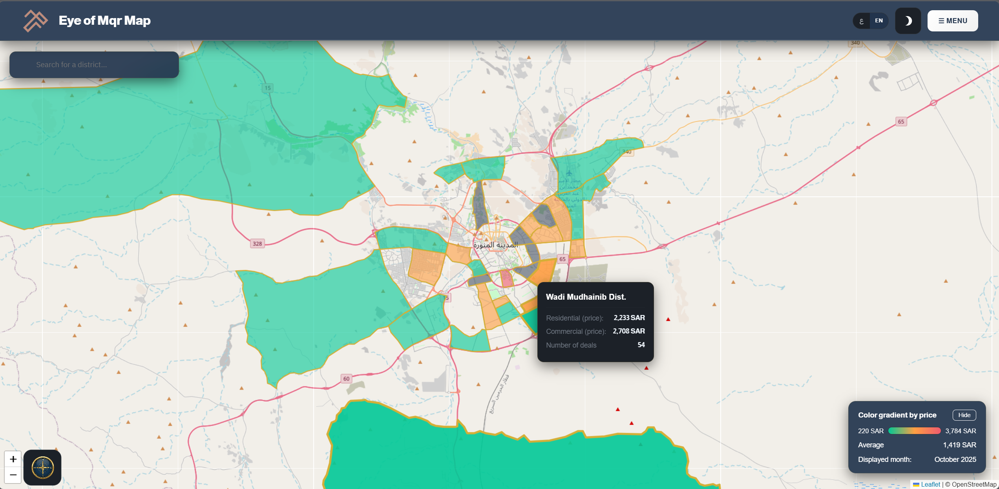
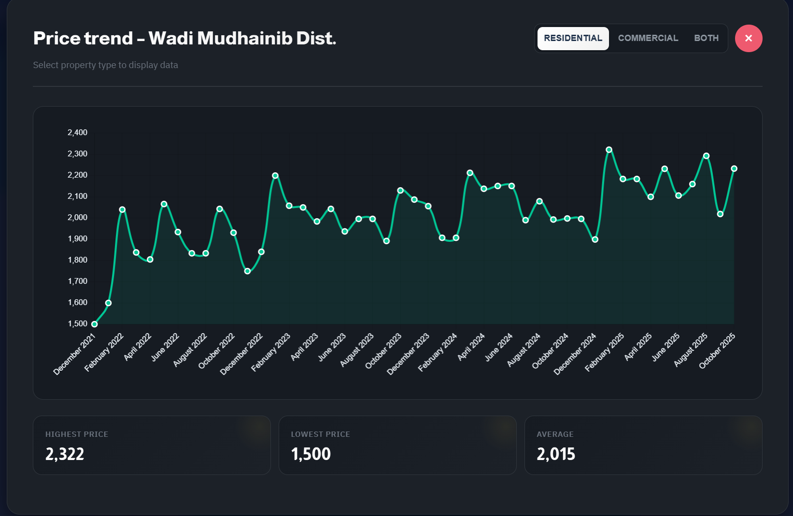
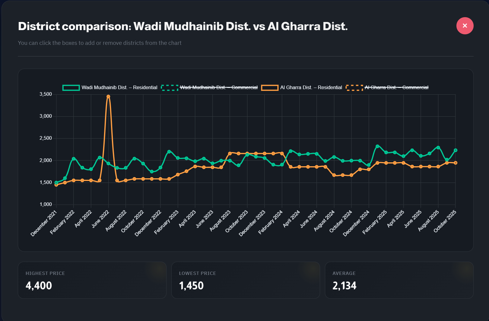

# Eyn Al-Muqr — Interactive Real Estate Market Map

> ℹ️ This project was built as part of my role at Al-Mqr Development Company. As it is a company product, I'm not permitted to publish the source code here. However, the underlying data is open source and publicly published by Al-Mqr, so this repo showcases the project through description, the public data source, and screenshots.

## Overview

An interactive map/dashboard visualizing real estate market data across Madinah, built to support Al-Mqr's Annual Real Estate Market Report — including district-level pricing, transaction trends, and heatmaps of urban activity.

## My Contribution

- Built the interactive map interface for exploring real estate market data by district
- Cleaned and formatted the raw published market figures into a structured dataset suitable for mapping (standardizing values, fixing formatting inconsistencies, and preparing district-level data for visualization)
- Worked with publicly published market data (see [Al-Mqr's Annual Report 2025](https://almqr.com/wp-content/uploads/2022/08/تقرير-عين-المقر-السنوي-2025.pdf)) to power the visualization
- Delivered a tool used internally to support market analysis and reporting

## Tech Stack

HTML, CSS, JavaScript | Leaflet.js (interactive maps, GeoJSON district boundaries) | Chart.js (price trend & comparison charts)

## Screenshots

**Interactive district map with price data**

**Price trend view for a selected district**

**District comparison view**

## Related

- Full published report: [Eyn Al-Muqr Annual Report 2025](https://almqr.com/wp-content/uploads/2022/08/تقرير-عين-المقر-السنوي-2025.pdf)
